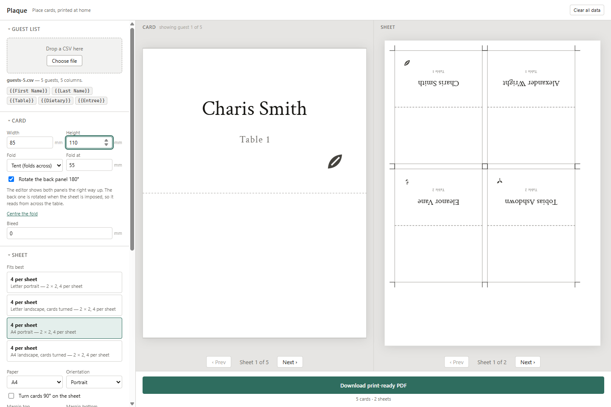

# Plaque

Turn a guest CSV into print-ready place card PDFs. Everything runs in your
browser — no account, no upload, no server. Your guest list never leaves your
device.



- Design one card in a freeform editor. Mix fixed text with `{{Column}}` tokens
  from your CSV, in any element.
- Drop in a monogram, crest or venue mark as a PNG or JPEG.
- Any card size, any fold position, custom bleed and margins — with layout
  suggestions that work out how to waste the least card stock.
- Tent cards print the back panel rotated 180°, so it reads from across the
  table.
- Names that do not fit shrink, wrap, or tell you which guests are a problem —
  they never quietly become illegible. Choose the point they shrink around.
- Icons mapped from any column — dietary, entrée, anything — with your own SVGs
  if you want them.
- Vector PDF with embedded fonts: text stays selectable and sharp at any size.

## Development

```sh
npm install
npm run dev        # http://localhost:5173
npm run test       # vitest, including the PDF smoke test
npm run build      # static output in dist/
npm run sample     # writes sample-flat.pdf and sample-tent.pdf from the fixtures
```

`dist/` is a plain static bundle. It runs from any host, or straight off the
filesystem.

## How it fits together

A single scene graph in millimetres is the source of truth. Two renderers
consume it and neither owns any layout logic:

```
CSV rows ─┐
          ├─> bindings ─> card scenes ─> paginate ─> sheets ─┬─> SVG (screen)
template ─┘                                                 └─> pdf-lib (export)
```

- `src/core/` — pure TypeScript. No React, no DOM. All the geometry, text
  fitting, CSV and imposition logic, and nearly all the tests.
- `src/render/` — the two renderers. Read-only consumers of `core/`.
- `src/state/` — zustand store, undo history, localStorage and IndexedDB.
- `src/ui/` — the sidebar panels and app chrome.

Three rules hold the design together:

1. Every stored coordinate is a millimetre, top-left origin, y downward.
2. `src/render/pdf/renderPdf.ts` is the only file that flips the y-axis for
   PDF's bottom-left origin.
3. Font size and line breaks are decided once, in `src/core/text/fit.ts`, from
   fontkit metrics — never from the browser's own text layout. That is what
   stops the preview and the printed sheet from disagreeing.

Full design spec:
[docs/superpowers/specs/2026-08-17-plaque-design.md](docs/superpowers/specs/2026-08-17-plaque-design.md)

## Not in this version

Per-guest overrides · per-guest images from a column · multi-select in the
editor · `.woff2` uploads · double-sided printing · a print button (the PDF
downloads, then you print it) · menus and table numbers · touch editing ·
project export/import files.

## Licence

MIT. Bundled fonts and icons carry their own licences — see
[src/assets/fonts/LICENSES.md](src/assets/fonts/LICENSES.md).
