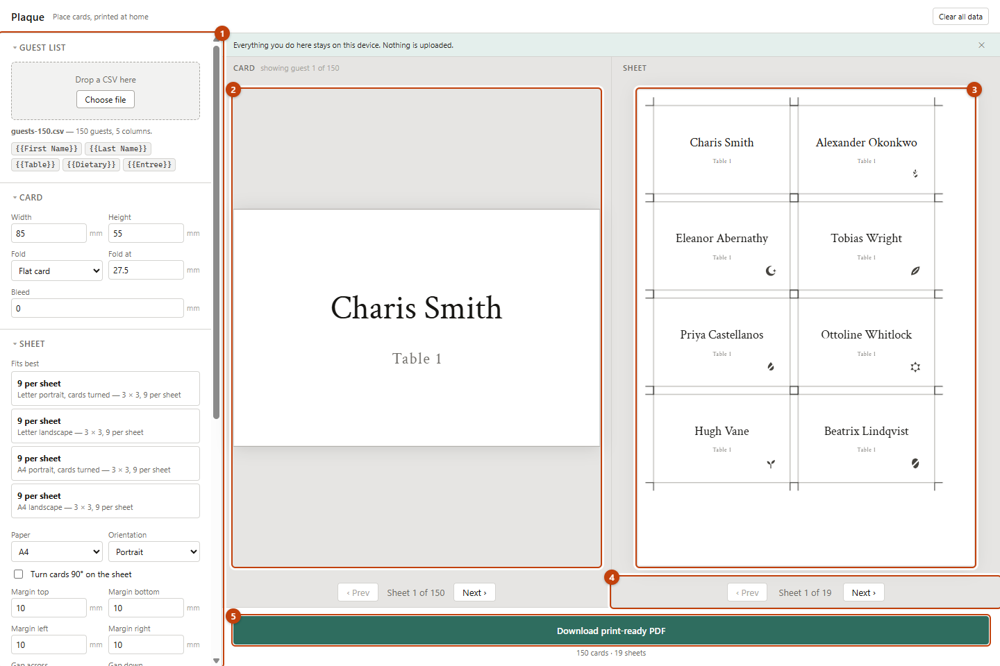
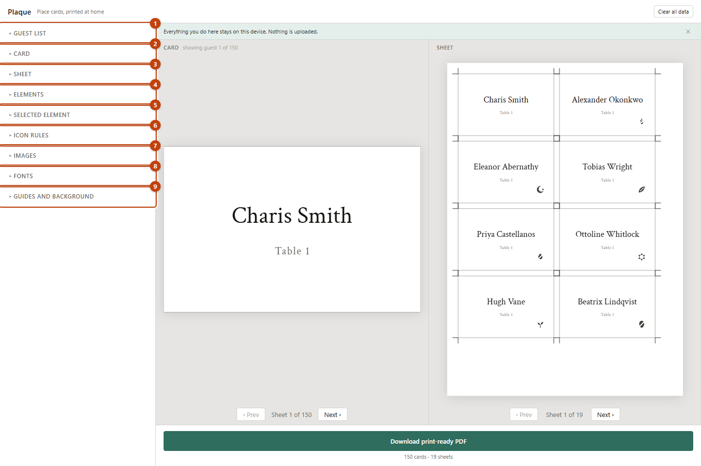
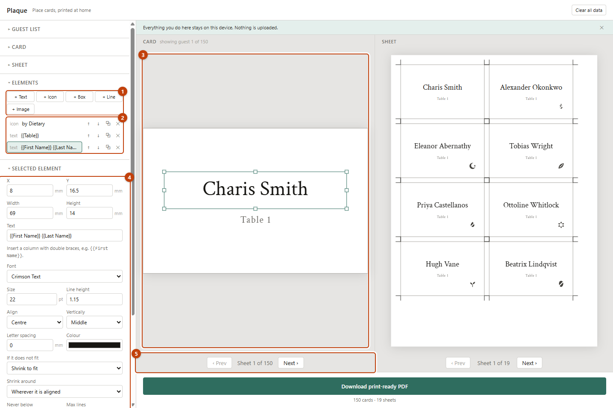
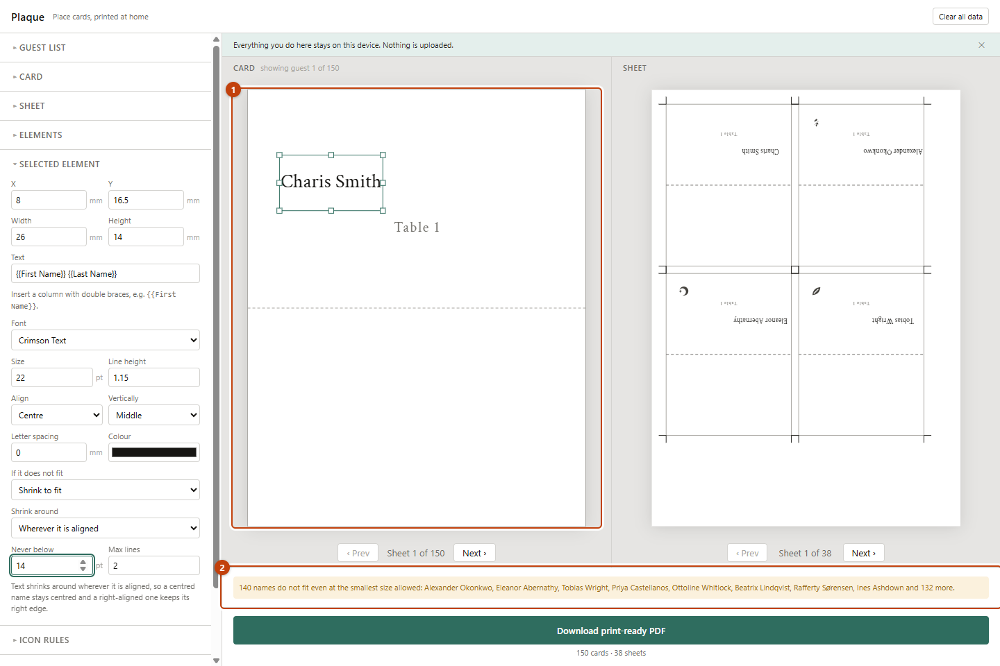
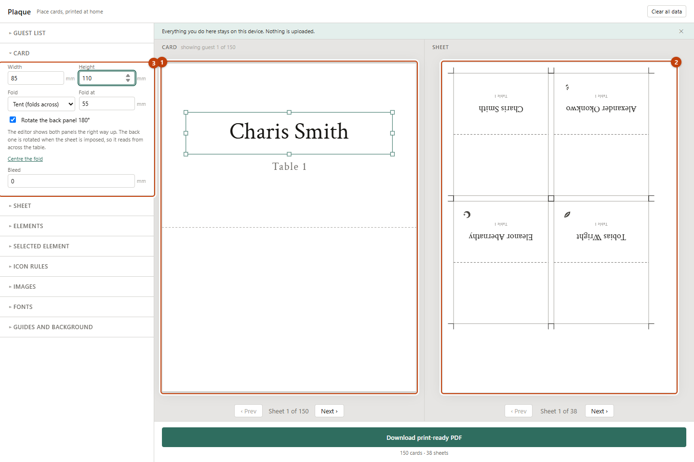

# Plaque — User Guide

Plaque turns a guest list into place cards you can print at home or hand to a
print shop. You design **one** card; Plaque prints it once per guest, laid out
on A4 or Letter sheets with the marks you need to cut them out.

Nothing you load is uploaded anywhere. Your guest list stays in your browser, on
your machine.

---

## Contents

1. [Before you start: your guest list](#1-before-you-start-your-guest-list)
2. [Five minutes to a printable PDF](#2-five-minutes-to-a-printable-pdf)
3. [The interface](#3-the-interface)
4. [Designing the card](#4-designing-the-card)
5. [Text that doesn't fit](#5-text-that-doesnt-fit)
6. [Card shapes and folds](#6-card-shapes-and-folds)
7. [Laying out the sheet](#7-laying-out-the-sheet)
8. [Icons](#8-icons)
9. [Images, fonts and colour](#9-images-fonts-and-colour)
10. [Printing it properly](#10-printing-it-properly)
11. [Your data](#11-your-data)
12. [Troubleshooting](#12-troubleshooting)
13. [Known limits](#13-known-limits)
14. [Running the code](#14-running-the-code)

---

## 1. Before you start: your guest list

Plaque reads a **CSV** file — the format every spreadsheet exports. In Excel,
Numbers or Google Sheets: *File → Export / Download → CSV*.

There is no required layout. Plaque reads whatever columns you have and makes
every one of them usable on the card. A typical list:

```csv
First Name,Last Name,Table,Dietary,Entree
Charis,Smith,Table 1,Vegetarian,Risotto
Alexander,Wright,Table 1,None,Beef
Eleanor,Vane,Table 2,Gluten-Free,Chicken
```

Things that are handled for you, so don't spend time on them:

- **Any column names.** `Guest`, `Seat`, `Course 2`, `Notes` — all fine.
- **Extra columns** you don't use on the card.
- Quoted fields containing commas, accented and non-Latin names, stray blank
  lines, and rows with a missing value at the end.

One habit worth keeping: **spell dietary values consistently**. Plaque matches
them exactly, so `Gluten-Free` and `Gluten Free` are two different values. It
already knows the common spellings of the usual requirements, and anything it
doesn't recognise you can map by hand in one click.

---

## 2. Five minutes to a printable PDF

1. **Drop your CSV** onto the Guest list panel, top left.
2. A card appears with each guest's name on it. Plaque has guessed your name and
   table columns and laid out a starting design.
3. **Pick a layout** from *Fits best* in the Sheet panel — each option tells you
   how many cards it gets per sheet.
4. **Drag things around** on the card until it looks right.
5. **Download print-ready PDF**.
6. Print it at **100% scale** — see [§10](#10-printing-it-properly), it matters
   more than anything else here.

Everything below is detail on doing that well.

---

## 3. The interface



| | |
|---|---|
| **1** | **Controls sidebar.** Every setting lives here, grouped into collapsible panels. |
| **2** | **Card editor.** One card, with real guest data in it. This is where you drag things. |
| **3** | **Sheet preview.** Exactly what a printed page will look like, including cut marks. |
| **4** | **Pagination.** Step through sheets — and, under the card, through guests. |
| **5** | **Download.** Tells you the card and sheet count before you commit. |

The two previews serve different jobs. The **card** is for designing; the
**sheet** is for checking. Flip through guests under the card to see how your
design copes with the longest name on your list — that is usually the one that
breaks a layout.

### The nine panels



| | Panel | What it's for |
|---|---|---|
| **1** | Guest list | Load your CSV; see row count and any rows that need a look. |
| **2** | Card | Physical size, fold, bleed. |
| **3** | Sheet | Paper, margins, gaps, and layout suggestions. |
| **4** | Elements | Add things to the card; reorder, duplicate, delete. |
| **5** | Selected element | Every property of whatever you've clicked. |
| **6** | Icon rules | Which icon appears for which value, on any column. |
| **7** | Images | Upload a monogram, crest or venue mark. |
| **8** | Fonts | Six bundled faces, plus your own. |
| **9** | Guides and background | Crop marks, fold lines, card colour, snapping. |

Click a panel heading to open or close it. Keeping only the one you're using
open makes the sidebar far easier to work in.

---

## 4. Designing the card



| | |
|---|---|
| **1** | **Add an element** — text, icon, box, line or image. |
| **2** | **The layer list.** Topmost first. Raise, lower, duplicate or delete each one. Click to select. |
| **3** | **The card.** Drag to move; drag a handle to resize. |
| **4** | **The inspector.** Everything about the selected element, including exact millimetres. |
| **5** | **Guest pagination.** Check your design against a different name. |

### Fixed text and guest text, mixed freely

A text element's content is just text — but anything in `{{double braces}}` is
replaced with that guest's value:

| You type | Charis Smith gets |
|---|---|
| `{{First Name}} {{Last Name}}` | Charis Smith |
| `Seated at {{Table}}` | Seated at Table 1 |
| `Top Table` | Top Table |
| `{{First Name}} — {{Entree}}` | Charis — Risotto |

The Guest list panel shows every available token; the exact spelling matters, so
copy it from there. A token naming a column that doesn't exist renders as
nothing and Plaque tells you which one it was — it will never print `{{Nickname}}`
onto a hundred cards.

### Dragging accurately

- **Snapping** pulls edges and centres to the card's edges, its centre, the fold
  line, and other elements. Toggle it in *Guides and background*.
- **Arrow keys** nudge by 1mm; **Shift + arrow** by 0.1mm.
- The **X / Y / Width / Height** boxes in the inspector are the real truth. Drag
  to get close, type to be exact.

### Keyboard

| Key | Action |
|---|---|
| `Ctrl`/`Cmd` + `Z` | Undo |
| `Ctrl`/`Cmd` + `Shift` + `Z` | Redo |
| `Ctrl`/`Cmd` + `D` | Duplicate selected |
| `Delete` / `Backspace` | Delete selected |
| `Esc` | Deselect |
| Arrows | Nudge 1mm |
| `Shift` + arrows | Nudge 0.1mm |

---

## 5. Text that doesn't fit

Every guest list has a Bartholomew Featherstonehaugh. Plaque handles this per
element, and tells you when it can't.



| | |
|---|---|
| **1** | The name is wider than its box. |
| **2** | The warnings bar **names the guests affected** — not just "some names don't fit". |

**If it does not fit** offers four behaviours:

| Setting | What happens | Use it when |
|---|---|---|
| **Shrink to fit** | Font size drops in ½pt steps until it fits | Default. Keeps every card on one line. |
| **Wrap onto more lines** | Breaks at a space, keeps the size | You'd rather two lines than smaller text |
| **Wrap, then shrink** | Wraps first, then shrinks if still needed | Long double-barrelled names |
| **Leave it and warn me** | Changes nothing, reports the overflow | You want to fix each case by hand |

**Never below** is the floor. Plaque will not shrink past it — instead it renders
at that size, overflows, and tells you which guests. That is deliberate: a 5pt
name is not a place card, and you should know before you print rather than after.

**Shrink around** decides where the text stays put as it shrinks. Leave it on
*Wherever it is aligned* and centred text stays centred, right-aligned text keeps
its right edge — which is what you want almost always. Change it only when you
want something unusual, like centred lines that stay pinned to a left margin.

> **Tip.** Before printing, page through to the longest name on your list using
> the pagination under the card. If it holds there, it holds everywhere.

---

## 6. Card shapes and folds

Set any width and height you like in millimetres. Common starting points:

| Style | Size | Fold |
|---|---|---|
| Flat place card | 85 × 55mm | Flat |
| Tent place card | 85 × 110mm | Tent, fold at 55 |
| Large tent | 100 × 140mm | Tent, fold at 70 |

### Tent cards



| | |
|---|---|
| **1** | **The editor shows both panels upright.** That's how you design. |
| **2** | **The sheet shows the back panel rotated 180°.** That's how it prints. |
| **3** | Card settings, with the fold position and the rotate toggle. |

This is the one part of Plaque that looks wrong until you understand it. Cut out
an 85 × 110mm card and fold it across the middle: the bottom half faces your
guest, and the top half swings round to face the table opposite — **upside
down**. So it has to be printed upside down to read correctly.

You design it the right way up. Plaque flips it when it lays out the sheet.
The dashed line is where you fold.

> **A gotcha worth knowing.** Changing the card size does **not** move your
> existing elements — Plaque won't rearrange a design you made. If you build a
> flat card and then make it a tent, everything you placed stays in the top half,
> which is now the back panel. Drag what you want on the front down below the
> fold line, then select it and press `Ctrl+D` to put a copy on the other panel.

A **fold down the middle** (vertical) is also available for folded cards, but the
180° rotation does not apply to it: folding about a vertical axis *mirrors* the
back panel rather than rotating it, and mirrored text is unreadable. Plaque
disables the toggle and says so rather than printing something useless.

---

## 7. Laying out the sheet

### Let Plaque work it out

The **Fits best** list ranks paper, orientation and card rotation by how many
cards each combination gets onto a sheet. Click one to apply it. For an 85 × 55mm
card that's 8 per A4 sheet; turning the cards can often gain you one or two more.

Fewer sheets means less card stock and less cutting.

### Margins, gaps and your printer

| Setting | What it does |
|---|---|
| **Margins** | Blank border on each edge of the paper |
| **Gaps** | Space between cards — cutting room |
| **Printer's unprintable border** | How close your printer can actually get to the edge |

Almost every home printer refuses to print within ~5mm of the paper edge. Set
that figure here and Plaque will warn you when your margins stray inside it,
rather than letting you discover it on a ruined sheet.

### Bleed

Bleed only matters if your card has a **background colour or artwork running to
the edge**. It extends that colour past the cut line, so a slightly off cut still
leaves no white sliver. 3mm is standard.

With bleed on, leave gaps of at least twice the bleed so neighbouring cards don't
print into each other. Plaque warns you if they would.

### Guides

Under *Guides and background*:

- **Crop marks** — corner marks to line a blade up against. Sit outside the bleed.
- **Cut lines** — the card outline itself. Handy for scissors, wasteful of ink at
  scale; turn off if you're using a guillotine and crop marks.
- **Fold guides** — dashed, on the fold. Score along these.
- **Bleed boundary** — **on screen only**, never printed.

---

## 8. Icons

Icons aren't only for dietary requirements — an icon element reads **any column**
and shows a different mark per value. Dietary is just the common case.

**To set one up:**

1. *Elements → + Icon*, and drag it where you want it.
2. In *Selected element*, choose the column to read.
3. In *Icon rules*, pick an icon for each value found in that column.

Plaque lists only the values your list actually contains, so there's nothing to
type. The common spellings of the usual requirements are pre-mapped — `Vegetarian`,
`Gluten-Free`, `GF`, `Vegan`, `Nut-Free`, `Halal`, `Kosher` and more.

Values with no icon simply print nothing. `None` is normally what you want left
blank.

**Several icons at once** is fine: add one icon element per column — dietary in
one corner, entrée in another. The Icon rules panel shows a tab per element so
you always know which one you're editing.

**Your own icons:** upload an SVG. It must be made of shapes, not text or
embedded pictures — if your artwork has lettering, convert it to outlines in your
drawing program first. Plaque will tell you clearly if a file won't work rather
than half-drawing it.

> **Please check the bundled icons print legibly at your chosen size before
> committing to a full run.** They're clean and clear at 8mm, but they're
> geometric marks, not illustrated artwork. For anything where a caterer must
> read them at speed, consider uploading your own.

---

## 9. Images, fonts and colour

**Images** — *Elements → + Image*, then upload a PNG or JPEG under *Images*. Good
for a monogram, a crest, a venue mark or a decorative rule. The same image goes
on every card.

- **Fit inside, keep shape** never distorts your artwork. **Fill the box** stretches it.
- **Opacity** takes it down to a watermark you can put a name on top of.
- PNG and JPEG only — those are the formats a PDF can carry directly. For an SVG,
  use the icon uploader instead.

**Fonts** — six are bundled: Crimson Text (and a semibold), Marcellus, Lato,
Great Vibes and Parisienne. Upload your own as `.ttf` or `.otf`. Web font files
(`.woff`, `.woff2`) can't be embedded in a PDF; if you have one of those, find
the `.ttf` or `.otf` the font shipped with.

Whatever you use is embedded in the PDF, so a print shop sees exactly what you
see, with no font substitution.

**Colour** — each text, icon, box and line element has its own colour, and the
card has a background colour under *Guides and background*. If you set a
background, turn bleed on before printing.

---

## 10. Printing it properly

This section is short and it is the most important part of the guide.

### Print at 100%

In the print dialog, find the scaling option and set it to **100%**, **Actual
size**, or **None**. **Turn off "Fit to page" / "Shrink to printable area".**

If you don't, your printer will shrink the page by a few percent to fit its own
margins, and every card comes out slightly too small. The crop marks will still
line up with each other, so it looks fine — you won't notice until the cards
don't fit your holders.

**Check it once:** print a single sheet, measure a card with a ruler. 85mm should
be 85mm. Get that right and the rest of the run is safe.

### The rest

- Print from a **PDF viewer**, not from a browser preview. Browsers add their own
  headers, margins and scaling.
- Use the heaviest stock your printer takes — 250–300gsm for place cards. Check
  its manual first.
- **Print one sheet before all nineteen.** Check size, colour and that the names
  are the ones you expect.
- For tent cards, score along the dashed fold line with the back of a craft knife
  before folding. It gives a much crisper edge.
- Cut with a guillotine or a steel rule and a sharp blade. Crop marks are there to
  line up against.

### Handing it to a print shop

Give them the PDF as-is. Everything is embedded and it's vector throughout, so it
will print at any size. Tell them the trim size, whether there's bleed, and that
crop marks are included.

---

## 11. Your data

Plaque has no server. Your guest list is read in the browser and never sent
anywhere — verified by an automated test that fails the build if any external
address appears in it.

**What that means for you:**

- Your work is saved **in this browser, on this device**. A different browser or
  a different computer will not have it.
- Clearing your browser's site data clears your design too.
- Uploaded fonts and images are stored the same way.

### Saving a project

**Save project** writes everything — the design, the guest list, and any fonts
and images you uploaded — into a single `.plaque.json` file you can keep
anywhere. **Open project** loads one back.

Use it to move a design to another computer, to keep a backup before pressing
Clear all data, or to hand the whole job to someone else. The file is
self-contained: it carries your uploaded artwork inside it, so it opens correctly
on a machine that has never seen those files.

**Clear all data** in the top right deletes the guest list, the design and your
uploads from the device. It cannot be undone — save a project first if you want
to keep the work.

If your list contains personal information — and a wedding guest list with
dietary requirements does — remember that it stays in your browser storage until
you clear it. On a shared computer, clear it when you're finished.

---

## 12. Troubleshooting

| What you see | Why | Fix |
|---|---|---|
| Nothing on the card after loading a CSV | The design was already there and Plaque won't overwrite your work | *Elements* → add a text element, or *Clear all data* and start again |
| `{{Something}}` shows as nothing | No column by that name | Check the exact spelling against the tokens in the Guest list panel |
| A name overflows its box | It won't fit at your minimum size | Widen the box, lower **Never below**, or switch to *Wrap, then shrink* |
| No icon for some guests | The value isn't mapped | *Icon rules* — pick an icon for that value |
| "No cards fit at these settings" | The card is larger than the printable area | Smaller card, smaller margins, landscape, or tick *Turn cards 90°* |
| Cards print the wrong size | Printer scaling | Print at 100% / Actual size, **not** Fit to page |
| Crop marks run off the page | Margins too small for marks plus bleed | Increase margins to at least bleed + 5mm |
| Text upside down on the sheet | Correct for a tent card's back panel | See [§6](#6-card-shapes-and-folds) |
| "Plaque needs a bigger screen" | Below 1024px wide | Open it on a laptop or desktop |
| Everything vanished | Different browser/device, or site data cleared | Storage is per-browser. Reopen a saved `.plaque.json` if you have one |

---

## 13. Known limits

Worth knowing before you plan around them:

- **Desktop only.** Below 1024px Plaque shows a notice instead of the editor.
- **One design for everyone.** No per-guest tweaks, and images are the same on
  every card.
- **Single-sided.** No duplex printing.
- **No print button.** Download the PDF, then print it from your viewer.
- Changing the card size doesn't reposition existing elements.
- The "names that don't fit" list checks every guest, so on a long list it can
  trail your edits by a moment. It always catches up; the card and sheet
  previews stay responsive meanwhile.

---

## 14. Running the code

Plaque is a static site — no server, no database, no configuration.

```sh
npm install
npm run dev     # http://localhost:5173
npm run build   # static output in dist/
npm run test    # full test suite
```

Serve `dist/` from any static host. It also runs straight off the filesystem.

**One deployment note:** serve it over `https://` (or `localhost`). On a plain
`http://` address some browsers disable the API Plaque uses to generate element
IDs, and adding elements will fail.

Developer documentation is in [README.md](README.md); the full design spec and a
record of the decisions behind it are in
[docs/superpowers/specs/](docs/superpowers/specs/).

---

MIT licensed. Bundled fonts and icons carry their own licences — see
[src/assets/fonts/LICENSES.md](src/assets/fonts/LICENSES.md).
